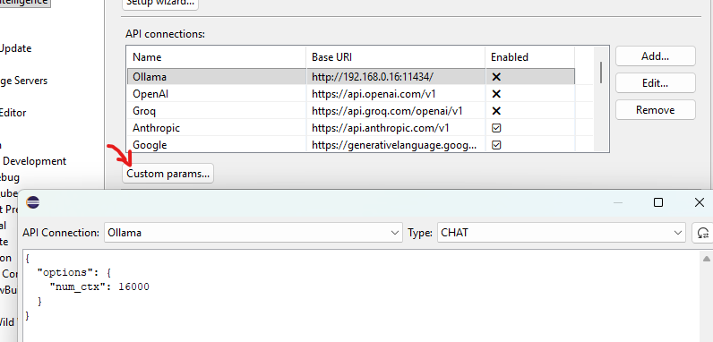

# Custom Request Parameters

The `Custom params...` dialog lets you attach provider-specific JSON to an API connection.

This is useful when a provider supports request fields that do not have a dedicated setting in the Eclipse preferences UI. For Ollama, this includes parameters such as `num_ctx`, `top_k`, and `top_p`.

## Where to find it

Open `Window -> Preferences -> Code Intelligence` and click `Custom params...`.



The dialog stores JSON per:

- API connection
- request type: `CHAT` for chat conversations, `INSTRUCT` for completion-style requests

The JSON format depends on the API you use. The plugin does not translate parameter names between providers, so the payload must match the request format expected by that provider.

Currently, the dialog is available for:

- Ollama
- OpenAI-compatible connections
- OpenAI Responses
- Anthropic
- Gemini
- X.ai

## How parameters are applied

Custom params are used as a request preset for the selected connection and request type.

After loading that preset, the plugin adds the required request fields for the current operation, such as the model name, messages, and streaming mode. Some additional fields are only filled in when they are missing.

In practice, that means:

- Custom params are best used for optional provider-specific tuning fields.
- Required protocol fields controlled by the plugin are not meant to be overridden.
- If the plugin later sets a field explicitly, the plugin value wins.
- If the plugin only supplies a default when a field is missing, your custom value is kept.

## Ollama

For Ollama, tuning parameters such as context and sampling settings belong inside the `options` object.

### Increase the context window

Use this to override Ollama's default context size:

```json
{
  "options": {
    "num_ctx": 16000
  }
}
```

### Adjust sampling

Example:

```json
{
  "options": {
    "top_k": 20,
    "top_p": 0.9
  }
}
```

- `top_k` limits sampling to the top `k` candidates.
- `top_p` enables nucleus sampling and keeps tokens whose cumulative probability stays within `p`.

### Combined example

```json
{
  "options": {
    "num_ctx": 16000,
    "top_k": 20,
    "top_p": 0.9
  }
}
```

If you want the same settings for both chat and completion requests, configure both `CHAT` and `INSTRUCT`.

For the full list of Ollama request parameters, see the official [Ollama API documentation](https://github.com/ollama/ollama/blob/main/docs/api.md).

## Tips

- Start with `Reset to Default` if you want a provider-specific template.
- Use `{}` to keep the provider defaults.
- Clear the editor if you want to remove the custom params for the currently selected connection and type.
- Use valid JSON that matches the provider's API.
