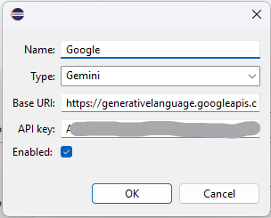

# Frequently Asked Questions
## Setup
### How do I configure model X?
You can find example settings for the supported providers in [README.md](README.md).

The procedure usually follows the same pattern. Here's e.g. the steps you follow for Gemini:
1. Go to https://aistudio.google.com/app/apikey and generate a new key.
2. Install the Code Intelligence plugin in your Eclipse.
3. Open the menu Window -> Preferences, go to Code Intelligence, and add a new API Connection:
  - Name: Gemini
  - Type: Gemini
  - Base URI: https://generativelanguage.googleapis.com/v1beta
  - API key: [your api key]
4. Change the Model to the desired one (Gemini/models/gemini-2.0-flash).
5. Additionally, you can also enable the chat by adjusting the desired model for this function.

