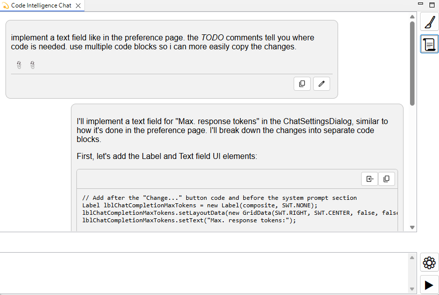
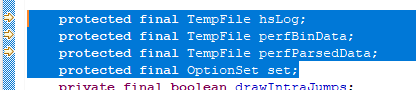
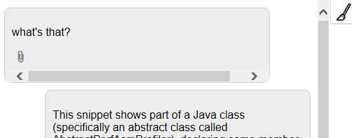
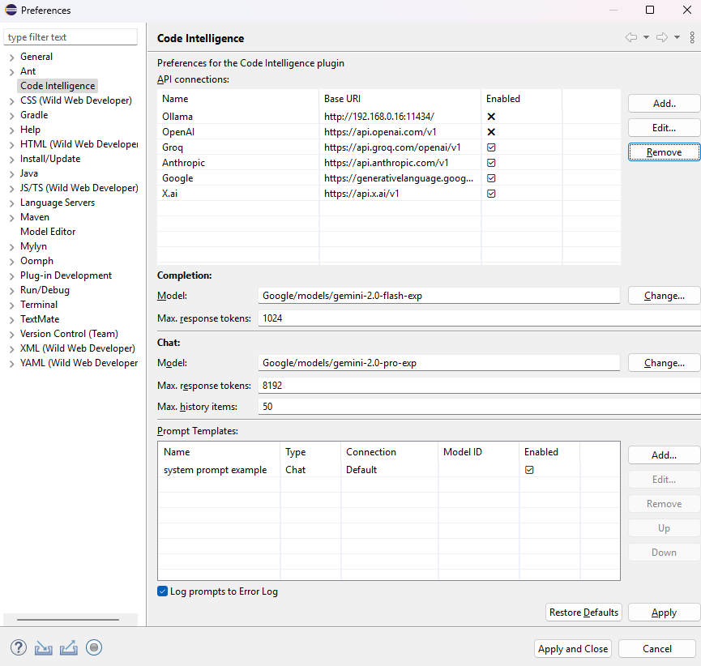

# Code Intelligence

This Eclipse plugin enhances the Java Development Tools (JDT) with AI code completion and reasoning in a chat view.

## Installation

The update site is hosted on [https://chabicht.github.io/code-intelligence/update-site/](https://chabicht.github.io/code-intelligence/update-site/).

In Eclipse, open *Help* -> *Install New Software...*.  
In the dialog, click on *Add...* and enter the new repository information. For *Location*, use the URL above.  

**Make sure the "Contact all update sites" box is checked, some dependencies are hosted in the update site of your Eclipse distribution.**

# Usage

## Completion

The completion feature is integrated in the JDT completion proposal mechanism.  
So when you invoke it by e.g. pressing *Ctrl + Space*, an AI completion is triggered by default.

What also works really well is adding a `// TODO` comment above where you want an ai completion.

## Chat

You can open a (for now rudimentary) chat view. Go to *Window* -> *Show View* -> *Other...* and select the *Code Intelligence Chat* view.

### Adding context information

If you select text in a Java editor, that selection is added automatically to the context of the next chat message.  
  

You also can right-click on several Java code items such as files, classes, fields, search results, etc.  

It's important to be careful with the amount of context you add. Depending on the model used too much information can easily overwhelm the model or become expensive in terms of API fees.

# Configuration

Open the preferences: *Window* -> *Preferences* -> *Code Intelligence*.

Here you can add connections to different API providers and configure the model you want to use for *code completion* and *chat* requests.

## Ollama connection settings

- Use *Type* Ollama.
- For the *Base URI*, use the host and port your Ollama instance is running.  
  Default is `http://localhost:11434`.
- Usually you don't need an API key.

## OpenAI connection settings

- Use *Type* OpenAI.
- For the *Base URI*, use `https://api.openai.com/v1`.
- You have to create an API key in the [OpenAI Platform settings](https://platform.openai.com/settings/organization/api-keys).  
  Note: This doesn't work with a ChatGPT subscription. You need to set up API access.  
  For a tutorial, cf. e.g. [this video on YouTube](https://www.youtube.com/watch?v=OB99E7Y1cMA).

## Groq.com connection settings

- Use *Type* OpenAI.
- For the *Base URI*, use `https://api.groq.com/openai/v1`.
- You have to create an API key in the [Groq playground](https://console.groq.com/keys).

## Anthropic connection settings

- Use *Type* Anthropic.
- For the *Base URI*, use `https://api.anthropic.com/v1`.
- You have to create an API key in the [Anthropic Console settings](https://console.anthropic.com/settings/keys).  

## X.ai/Grok connection settings

- Use *Type* X.ai.
- For the *Base URI*, use `https://api.x.ai/v1`.
- You have to create an API key in the [X.ai Console settings](https://console.x.ai/).  

## DeepSeek connection settings

- Use *Type* OpenAI.
- For the *Base URI*, use `https://api.deepseek.com`.
- You have to create an API key in the [DeepSeek platform](https://platform.deepseek.com/api_keys).  

## Model selection

The model is identified by `[Connection Name]/[Model ID]`, so assuming your OpenAI connection was named *OpenAI*, to use GPT-4o-Mini, you would enter `OpenAI/gpt-4o-mini`.

Clicking on *Change...* opens a dialog where you can select a model from the enabled connections.

## Prompt Templates

For an intro to writing custom prompts, see [PROMPT-TEMPLATES.md](PROMPT-TEMPLATES.md).

# Customizing code completion behaviour

By default the an AI request happens when a code completion is triggered.

You can change that behaviour in the settings under *Java* -> *Editor* -> *Content Assist* -> *Advanced*.

- If *Code Intelligence* is selected in the 'default' section, it is called every time a completion is triggered.
- If *Code Intelligence* is selected in the cycling section, it is triggered when you cycle through the different proposal kinds.
